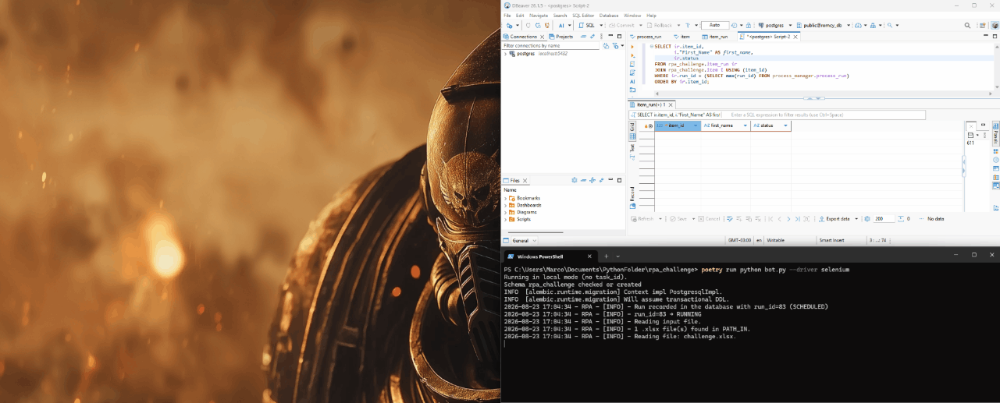

# RPA Challenge — production-style bot with two browser drivers

[](https://github.com/mromcy/RPA-Challenge/actions/workflows/ci.yml)


<!-- The badge is filtered to event=push on purpose. Unfiltered, it would show
     the last run of the whole workflow, and that includes the Monday schedule
     with the live lane against rpachallenge.com - so a badge could go red
     because someone else's site was down, which is the exact confusion this
     project separated the two lanes to avoid. -->


A Python RPA bot that solves the [RPA Challenge](https://rpachallenge.com/): it
reads records from an Excel file, tracks every item through a queue in
PostgreSQL, and fills the form in a real browser. It is built the way a
production robot is built — state machine, audit trail, encrypted credentials,
orchestrator integration — and it drives the browser through **two
interchangeable implementations, Playwright and Selenium**, so the two can be
compared on the same flow with the same code.

<!-- The demo is not recorded yet; the line stays commented out because GitHub
     renders a missing image as a broken-image icon, and this is the first
     screen of the page. Uncomment it when assets/demo.gif exists.

-->

---

## Results at a glance

Both drivers run the *same* business code behind a `BrowserDriver` protocol,
against the same Chrome build, on the same machine. Median of 5 runs.

| | Playwright | Selenium | |
|---|---|---|---|
| End-to-end time | **4.59 s** | 9.50 s | 2.1× |
| Form filling only | **0.81 s** | 5.45 s | 6.7× |
| Explicit waits in the driver | **1** | 4 | |
| Failures in 10 end-to-end runs | **0** | **0** | |

The interesting number is the one that barely moves: everything *except*
filling — launching the browser, navigating, reading the result — takes 3.78 s
against 4.42 s. Ninety-four percent of the gap happens during the interactions,
not at startup. And with zero failures on both sides, the difference is speed,
not reliability.

→ [Full methodology, mechanism and limitations](#playwright-vs-selenium)

---

## The challenge

The [RPA Challenge](https://rpachallenge.com/) asks a bot to:

1. Read a spreadsheet of people
2. Open the site and click **Start**
3. Fill a seven-field form for each record and submit it
4. Repeat for all records — **the fields move position on every round**
5. Read the success rate the site reports at the end

Step 4 is the trap. Any selector based on position fills the wrong box, so every
field has to be located by its visible label.

---

## Design rationale

Solving the challenge takes about forty lines of code. This repository is not
forty lines, and that is deliberate: it is built to demonstrate the patterns a
**production** RPA process needs, on a problem small enough to read in one
sitting.

**A queue with per-item state, not a loop.** Each record becomes a row that moves
`QUEUED → PROCESSING → COMPLETED | FAILED`, with timestamps and a failure reason.
Ten records do not need this. Five thousand invoices do: when the run dies at
item 3,200, someone has to answer *which ones went through, which failed, and
why* — without re-running the successful ones.

**PostgreSQL and Alembic, not a log file.** The audit trail outlives the process,
survives the machine, and can be queried by people who do not have access to the
robot. Migrations version the schema so a change is applied the same way
everywhere instead of by hand.

**Fernet-encrypted credentials.** Robots run unattended, often on shared machines
someone else administers. Database credentials in a plain config file are a
credential leak with extra steps.

**Orchestrator integration.** [BotCity Maestro](https://botcity.dev) schedules
the run, receives the outcome and item counts, and shows failures where the
operations team already looks. The bot runs identically without it.

**A driver abstraction — because there are two implementations, not because
there might be one.** The business flow talks to a `BrowserDriver` protocol and
never imports Playwright or Selenium; a test asserts that in a subprocess. That
inversion is what makes the comparison in this README possible at all, and what
lets the whole flow be tested with no browser.

None of this is accidental over-engineering. For a ten-row spreadsheet a script
would do — and the fastest way to see the difference is to compare
`resources/Modules/challenge.py`, which holds the business flow and nothing
else, against everything around it that exists to make the run **observable,
resumable and reproducible**.

---

## How it works

```
Excel (Entrada/) → PostgreSQL queue → Browser driver → Result
      │                   │                  │              │
   read and           per-item state     fill the form   success rate
   clean rows         and audit trail    by label        stored per item
                           │
                     BotCity Maestro
                  (scheduling, monitoring,
                     outcome reporting)
```

---

## Architecture

```
rpa_challenge/
├── bot.py                          # Entry point: wiring only, no logic
├── config.json                     # Local configuration (never committed)
├── config.example.json             # Template to copy
├── alembic.ini                     # Alembic configuration
├── Entrada/                        # Input .xlsx files
├── Saida/                          # Output files
├── logs/  downloads/  secret/      # Created on first run
│   └── db_credentials/
│       ├── credentials.json        # Fernet-encrypted user and password
│       └── secret.key              # Fernet key
├── migrations/versions/            # Alembic migration history
├── benchmarks/
│   ├── compare_drivers.py          # The measured comparison
│   ├── mechanism_experiment.py     # Isolates *why* one driver is slower
│   └── measure_flakiness.py        # Counts flaky runs per driver
├── tests/
│   ├── conftest.py                 # Shared fixtures; isolates settings cache
│   ├── fake_driver.py              # Records calls; no browser involved
│   ├── test_challenge.py           # Business flow, incl. architecture guard
│   ├── test_cli.py  test_cryptography.py  test_read_file.py
│   ├── test_settings.py
│   └── test_e2e_challenge.py       # Live site, both drivers (marker: e2e)
└── resources/
    ├── settings.py                 # Config via Pydantic + Fernet credentials
    ├── cli.py                      # Command-line parsing, kept out of bot.py
    ├── database.py                 # SQLAlchemy engine and session
    ├── models.py                   # ORM models and status enums
    ├── execute.py                  # Orchestrator, incl. BotCity integration
    ├── Drivers/
    │   ├── base.py                 # BrowserDriver protocol + shared timeout
    │   ├── selectors.py            # Selectors, shared by both drivers
    │   ├── playwright_driver.py    # Implementation 1
    │   ├── selenium_driver.py      # Implementation 2
    │   └── factory.py              # Builds the requested driver
    ├── Executors/execute_challenge.py
    ├── Modules/challenge.py        # Business flow — knows no browser library
    ├── Schemas/                    # Pydantic: ItemRun, Item, ItemInfo, ProcessRun
    ├── Tools/                      # Logging, BotCity, process_run creation
    └── Utils/                      # Excel reading, item creation, DB operations
```

---

## Playwright vs Selenium

Both drivers implement the same `BrowserDriver` protocol and are called by the
same business code. They share the selector strings, the timeout constant and,
for these measurements, the same Chrome binary. What differs between the two
columns below is the library, and — as far as this setup can isolate it —
nothing else.

Each driver is written in **its own documented style**: `WebDriverWait` with
`expected_conditions` on one side, auto-waiting locators on the other. Neither
is hand-tuned beyond what its documentation teaches, because the question worth
answering is not which library can be fastest in expert hands, but what a
competent developer following normal usage actually gets.

### Speed

Median of 5 runs, min–max in parentheses, warm-up discarded.

| Driver | total (s) | fill (s) | rest (s) |
|---|---|---|---|
| **Playwright** | **4.59** (4.47–5.03) | **0.81** (0.69–0.82) | **3.78** (3.75–4.21) |
| **Selenium** | 9.50 (9.28–10.85) | 5.45 (4.83–5.50) | 4.42 (3.98–5.35) |

`total` is measured here, end to end, and includes launching the browser.
`fill` is reported by rpachallenge.com itself — an independent measurement,
immune to where our stopwatch sits. `rest` is the subtraction, and it is
deliberately **not** called *startup*: it also contains the Start click and the
final read.

**The interesting number is `rest`.** Launching the browser and navigating costs
roughly the same on both sides — 3.78 s against 4.42 s, 17% apart. Of the 4.91 s
total difference, 4.64 s comes from the fill phase. Ninety-four percent of the
gap happens during the interactions, so the common assumption that Playwright
wins on browser startup does not hold for this flow.

### Complexity

Only the driver modules count: `base.py` and `selectors.py` are shared and
belong to neither side.

| Driver | statements | effective lines | explicit waits | `time.sleep` |
|---|---|---|---|---|
| **Playwright** | **47** | **55** | **1** | 0 |
| **Selenium** | 55 | 69 | 4 | 0 |

`statements` counts executable statements from the syntax tree and ignores
docstrings — it measures how much the program *does*. `effective lines` drops
docstrings, comments and blank lines — it measures how much you *read*. The two
differ because a single Selenium call spans more physical lines.

The waits column tells the story better than either size metric. Playwright
needs one explicit wait in the whole driver, because its actions already wait;
Selenium has to declare a wait at every interaction, and each of those is a
place where forgetting produces a flaky test.

### Reliability

The full end-to-end suite, run ten times per driver, one process each:

| Driver | runs | failures |
|---|---|---|
| Playwright | 10 | **0** |
| Selenium | 10 | **0** |

This is the result the comparison needs. It turns *"both drivers are equally
robust"* from an assertion into a measurement, which is what allows the timing
difference to be attributed to speed rather than reliability.

### Where the difference comes from

A number without a mechanism is a blog post. `benchmarks/mechanism_experiment.py`
isolates one variable at a time by subclassing the production driver:

| Variant | fill (s) | vs. Selenium |
|---|---|---|
| Playwright | 0.82 | 0.15× |
| Selenium | 5.53 | 1.00× |
| Selenium without any explicit wait | 4.66 | 0.84× |
| …and without the `clear()` before `send_keys` | 3.56 | 0.64× |

Removing **every** explicit wait recovers only 16%. Removing a single command
per field — the `clear()`, 70 calls per run — recovers another 20%, which puts
the cost at roughly **15.7 ms per command exchanged with the browser**.

Reading the Selenium source explains the rest: `element_to_be_clickable` is not
one question but three. It locates the element, asks whether it is displayed,
then asks whether it is enabled — each an HTTP round trip to `chromedriver`.
WebDriverWait is not slow because it waits; it is slow because it asks three
times.

Playwright runs the same checks, and more, **inside the browser**, and sends one
command over a persistent connection. It is not that one waits smarter — one
asks where the DOM is.

Note that even the stripped Selenium variant, which is *not* safe for production
because it reintroduces races, is still 4.3× slower than Playwright. That
residue is the protocol.

### Methodology

- Machine: AMD64, Windows 11, Python 3.13.5
- Browser: Chrome 150.0.7871.187, the same binary for both drivers
- 5 measured runs per driver, headless, first run of each discarded as warm-up
- Runs interleaved between drivers, not executed in blocks, so that any drift in
  network or machine load is spread across both
- Median reported, never the mean: one antivirus spike ruins a mean
- A failed run aborts the benchmark instead of being silently retried
- Flakiness measured separately: 10 runs of the real end-to-end suite per driver
- Date: 2026-08-03

### Limitations

Stated plainly, because the number is only worth what its limits are:

- **This is not a general benchmark of the two libraries.** It measures one flow,
  on one site, on one machine, on a home network. A different page — heavier
  DOM, more navigation, fewer form fields — would shift the balance.
- **The gap scales with the number of interactions, not with time.** This flow
  performs 81 interactions per run. A flow dominated by page loads rather than
  field entry would show a much smaller difference.
- **Wait parity is approximate.** Selenium's `element_to_be_clickable` covers
  *present*, *visible* and *enabled*, but not *stable* (not animating) and not
  *unobstructed* (nothing intercepting the click) — two checks Playwright makes
  before every action. Reproducing them would require custom conditions. See the
  `_esperar` docstring in `selenium_driver.py`.
- **Zero failures out of ten is not zero flakiness.** By the rule of three, no
  occurrences in N trials bounds the rate at roughly 3/N with 95% confidence —
  with ten runs, that is 30%. Claiming under 1% would take some three hundred
  runs.
- **Reliability here measures these implementations, not the libraries.** A
  Selenium driver written with `time.sleep` and absolute XPath would fail
  repeatedly. What separates them is the usage.

### What this means in practice

For this kind of flow — many small interactions with form fields — the cost that
matters is per-command round-trip, and it compounds with every field. A bot
filling seventy fields pays it seventy times. If you are choosing a library for
interaction-heavy automation, that is the number to look at, and it favours
Playwright by a wide margin.

The corollary matters just as much: if your automation is dominated by page
loads, downloads or waiting on a backend, most of this difference disappears,
because browser startup and navigation cost roughly the same on both. Choosing
on "Playwright is faster" without knowing which half of your runtime dominates
is choosing on a slogan.

And speed is not the only axis. Selenium's ecosystem, Grid support and the sheer
volume of existing code are real arguments that this benchmark does not measure.

### Reproducing it

```bash
poetry run task benchmark                              # timing, N=5
poetry run python -m benchmarks.mechanism_experiment  # where the time goes
poetry run python -m benchmarks.measure_flakiness     # reliability
```

The benchmark refuses to run unless `PATH_BROWSER` is set, because otherwise
Playwright would drive its own Chromium and Selenium the system Chrome, and part
of any measured difference would be browser against browser.

---

## Requirements

- **Python** 3.11, 3.12 or 3.13 — a range with both ends measured, not assumed.
  The floor is what the dependencies declare: of the sixty installed packages,
  numpy and pandas are the strictest and both require `>=3.11`. The ceiling has a
  name: `psycopg-binary` publishes one wheel per interpreter version and the
  pinned 3.2.9 stops at cp313, so 3.14 would fall back to building from source
  and need libpq and a C compiler. CI runs both ends. Outside the range the bot
  refuses to start and says why, because `pip` would install nothing and still
  report success
- **PostgreSQL** 13+, local or reachable over the network
- **Google Chrome** — needed by the Selenium driver; the Playwright driver ships
  its own Chromium
- **Git**
- A **BotCity Maestro** account is optional: the bot runs identically without one

---

## Installation

### 1. Clone

```bash
git clone https://github.com/mromcy/RPA-Challenge.git
cd RPA-Challenge
```

### 2. Install dependencies

Poetry is used to *develop* this project. It is **not** required to run it.

**To run the bot** — this is also what the BotCity runner installs:

```bash
python -m venv .venv

# Windows (PowerShell)
.venv\Scripts\Activate.ps1
# Linux/macOS
source .venv/bin/activate

pip install -r requirements.txt
```

**To develop, or to run the test suite:**

```bash
pip install -r requirements-dev.txt   # adds pytest, ruff, taskipy
```

```bash
# or, with Poetry
poetry install
```

`requirements-dev.txt` is self-contained: it already includes everything in
`requirements.txt`, so install one or the other, never both. Both files are
**generated** from `pyproject.toml` by `task export` and `task export-dev` —
add dependencies there, not in the `.txt` files.

Those two tasks call `poetry export`, which Poetry 2 no longer ships in its
core, so run `poetry self add poetry-plugin-export` once before using them. CI
installs the same plugin, re-exports both files and fails the build if either
one differs from what `pyproject.toml` produces — which is what keeps the two
`.txt` files from quietly falling behind.

### 3. Install the browser Playwright manages

```bash
playwright install chromium
```

Skip this if you only ever run `--driver selenium`, which drives the Chrome
already installed on the machine.

---

## Configuration

Copy the template and fill it in:

```bash
cp config.example.json config.json          # Windows: copy config.example.json config.json
```

`config.json` holds real credentials, is git-ignored, and must never be
committed.

| Field | Required | Description |
|---|---|---|
| `PROJECT_NAME` | yes | Process identifier in the database and in BotCity |
| `AREA` | yes | Owning area, recorded with every run |
| `PATH_URL` | yes | Target site |
| `HOST_DB_POSTGRES` | yes | PostgreSQL host |
| `PORT_DB_POSTGRES` | yes | PostgreSQL port (usually 5432) |
| `DB_NAME_POSTGRES` | yes | Database name |
| `DB_SCHEMA` | yes | Schema used by this project |
| `DRIVER` | no | `playwright` (default) or `selenium` |
| `PATH_BROWSER` | no | Browser executable, honoured by **both** drivers |
| `PATH_SELENIUM_DRIVER` | no | `chromedriver` executable, Selenium only |
| `PATH_BASE` | no | Repository root; derived automatically |
| `PATH_IN` | no | Input folder; defaults to `<repo>/Entrada` |
| `PATH_OUT` | no | Output folder; defaults to `<repo>/Saida` |

The three Maestro fields are structurally required but may hold placeholders
when running locally — they are only used when the bot logs in to the
orchestrator.

**On the optional fields, because the defaults are deliberate:**

`PATH_BASE`, `PATH_IN` and `PATH_OUT` are derived from the repository root, so a
fresh clone runs without configuring a single path. They remain configurable
because in production input and output folders are typically network shares.

`PATH_BROWSER` empty means each library uses the browser it manages: Playwright
its own Chromium, Selenium the system Chrome. Filling it makes **both** drivers
drive that one executable — which is what the benchmark requires, and what
matches the common corporate practice of pinning an approved browser version.

`PATH_SELENIUM_DRIVER` empty lets Selenium Manager download the `chromedriver`
matching the browser. It only needs a value on a machine with no internet
access.

`logs/`, `downloads/` and `secret/` are created on first use.

### When the code runs from somewhere else

By default the bot looks for `config.json` next to itself, which covers running
from a clone. An orchestrator does not work that way: it downloads the packaged
bot, extracts it into a working directory of its own, and runs it from there —
where no configuration exists.

One environment variable covers that. On Windows, from an **elevated**
PowerShell — machine scope, because a service runs under its own account and
would not see a user-scoped variable:

```powershell
[Environment]::SetEnvironmentVariable(
    'RPA_CHALLENGE_CONFIG', 'C:\path\to\the\project', 'Machine'
)
```

On Linux or macOS, in the service unit or the shell profile:

```bash
export RPA_CHALLENGE_CONFIG=/path/to/the/project
```

Processes read the environment when they start, so restart the runner — and
open a new terminal — before testing.

It accepts either the folder or the file, decided by whether the path has an
extension, never by touching the disk. And because `PATH_BASE` defaults to
**the folder the configuration was found in**, that single variable also
relocates `secret/`, `logs/` and `downloads/` — they belong next to the
configuration, not next to the code. Unset, everything falls back to the
repository root and a fresh clone needs no configuration at all.

---

### Database credentials (encrypted)

PostgreSQL credentials are stored encrypted with
[Fernet](https://cryptography.io/en/latest/fernet/) under `secret/`:

```
secret/
└── db_credentials/
    ├── credentials.json   ← {"email": "<encrypted>", "password": "<encrypted>"}
    └── secret.key         ← Fernet key (binary)
```

To generate them:

```python
import json
import os

from cryptography.fernet import Fernet

key = Fernet.generate_key()
fernet = Fernet(key)

os.makedirs('secret/db_credentials', exist_ok=True)

with open('secret/db_credentials/secret.key', 'wb') as f:
    f.write(key)

with open('secret/db_credentials/credentials.json', 'w') as f:
    json.dump(
        {
            'email': fernet.encrypt(b'your_user').decode(),
            'password': fernet.encrypt(b'your_password').decode(),
        },
        f,
    )
```

---

## Database and migrations

Create the database and the schemas:

```sql
CREATE DATABASE <database_name>;
\c <database_name>
CREATE SCHEMA IF NOT EXISTS rpa_challenge;
CREATE SCHEMA IF NOT EXISTS process_manager;
```

Then apply the migrations:

```bash
alembic upgrade head
```

This creates `rpa_challenge.item_run` (per-item tracking) and
`rpa_challenge.item` (form data and result). `process_manager.process_run` is
managed outside this project.

> `bot.py` runs `alembic upgrade head` itself before starting, so this step is
> only needed when setting the database up by hand.

---

## Input file

Drop one or more `.xlsx` files into `Entrada/`, with exactly these columns:

| Column |
|---|
| `First Name` |
| `Last Name` |
| `Company Name` |
| `Role in Company` |
| `Address` |
| `Email` |
| `Phone Number` |

Every `.xlsx` in the folder is read and concatenated, **oldest file first** by
modification time, so a batch left over from a previous day is processed before
today's. Column names are stripped of stray whitespace, and fully empty rows and
columns are dropped.

---

## Running

```bash
python bot.py                      # uses DRIVER from config.json
python bot.py --driver selenium    # overrides it for this run
python bot.py --driver playwright
python bot.py --help
```

`--help` works on a fresh clone, before any configuration exists.

Locally, the bot detects that no orchestrator started it and prints:

```
Executando em modo local (sem task_id).
```

Everything else runs normally; nothing is reported to Maestro.

### Through BotCity Maestro

Register the bot in the Maestro panel, deploy it, and trigger the task. The
runner appends its own arguments to the command line, which
`BotMaestroSDK.from_sys_args()` reads **positionally**. `--driver` is parsed and
removed from `sys.argv` before the SDK sees it, so the two coexist regardless of
the order they are written in. On completion the bot reports the outcome with
total, processed and failed counts.

---

## Tests

Two lanes, separated by a pytest marker.

```bash
pytest -m "not e2e"     # fast lane: no database, no browser, no config.json
pytest -m e2e           # live lane: real browser against rpachallenge.com
```

With Poetry, `task test` runs the fast lane with coverage and `task e2e` runs
the live one.

| Lane | Tests | Needs | Time |
|---|---|---|---|
| unit | 82 | nothing | ~2 s |
| e2e | 2 | network + browser | ~20 s |

**Why they are separated.** The end-to-end tests depend on a system nobody here
controls: the site can go down, change its DOM, or simply be slow. Running them
on every push produces red builds for reasons unrelated to the code, and a team
that sees red often enough learns to answer it with "run it again" — including
the day the red is real. The live lane belongs on a schedule and on demand, not
on every commit.

**That separation is what `.github/workflows/ci.yml` implements.** The fast lane
and a check that the exported `requirements*.txt` still match `pyproject.toml`
gate every push and pull request. The fast lane runs on 3.11 and 3.13, the ends
of the supported range, because compatibility breaks at the edges. The live lane runs Monday mornings and from
the Actions tab, never on a push, as two jobs — one per driver — so a failure
names the driver that broke without anyone opening a log.

**The fast lane needs no configuration at all.** No database, no `config.json`,
no browser. That is a property held on purpose, and two tests assert it by
checking that the settings cache was never touched. A `conftest.py` fixture
clears that cache around every test, so results never depend on execution order.

**The end-to-end test is one test, parametrised over both drivers.** Same
assertions, two browser backends — which is what cross-browser testing is. It
builds the drivers directly rather than through the factory: going through the
factory would apply the configured `PATH_BROWSER`, and once that is set both
cases would collapse onto the same browser and the cross-browser coverage would
vanish with every test still green.

**One test guards the architecture.** It runs a subprocess that imports the
business flow and asserts that no browser module was loaded — the property that
makes the driver abstraction real rather than decorative. Adding
`from playwright.sync_api import Page` to `challenge.py` turns that test, and
only that test, red.

**A fake driver replaces the browser.** `tests/fake_driver.py` records the calls
it receives, which turns *"the bot filled all seven fields with the right
values"* into a dictionary assertion that runs in milliseconds. It neither
inherits from nor imports the protocol — structural conformance is what makes
that possible.

Every test in this suite was validated by breaking the corresponding code on
purpose and checking that it, and only it, turns red. A test that cannot fail
proves nothing.

---

## Execution flow in detail

```
bot.py
  ├── parse --driver and remove it from sys.argv
  ├── alembic upgrade head                     (migrations run automatically)
  └── Execute(driver).execute()
        │
        ├── 1. BotMaestroSDK.from_sys_args()
        │      Reads the orchestrator arguments positionally.
        │      Fewer than four means local mode: task_id = None
        │
        ├── 2. AddProcessRun().execute()
        │      Inserts process_run with status SCHEDULED, returns run_id
        │
        ├── 3. update_process_run_status(RUNNING)
        │
        ├── 4. read_data(logs) → FileReader(...).read_file()
        │      Reads every .xlsx in Entrada/, oldest first,
        │      applies clean_dataframe and concatenates
        │
        ├── 5. create_items(df, run_id)
        │      For each row: ORMItemRun (QUEUED) + ORMItem with the form data
        │
        ├── 6. get_queued_items_by_run(run_id)
        │
        ├── 7. create_driver(...) → run_challenge(driver, logs, items, url, db)
        │      Launches the browser through the selected driver
        │      Opens the site and clicks Start
        │      For each item:
        │        ├── update_item_run_status(PROCESSING)
        │        ├── fills the seven fields, located by label
        │        ├── submits
        │        └── update_item_run_status(COMPLETED | FAILED)
        │      Reads the final success rate and stores it per item
        │      Returns (processed, failed)
        │
        ├── 8. driver.fechar() in a finally block
        │      A cleanup failure is logged as a warning, never allowed to
        │      mask the original error
        │
        ├── 9. update_process_run_status(COMPLETED)
        │
        └── 10. maestro.finish_task(SUCCESS, total, processed, failed)
                Only when a task_id is present.
                On any exception: finish_task(FAILED) + process_run(FAILED)
                with the message and the full stack trace stored in the database
```

---

## BotCity Maestro integration

The bot runs identically with or without the orchestrator.

`BotMaestroSDK.from_sys_args()` inspects the command line: when the runner
started the process it finds the server, task id, token and organization there
and connects; otherwise it falls back to a local instance with `task_id = None`,
and every Maestro call is skipped.

Because those arguments are read **by position**, `--driver` is parsed and
removed from `sys.argv` before the SDK sees it — otherwise a flag written before
them would shift every position and the bot would try to reach a server named
`--driver`.

### Packaging for the runner

The runner extracts the package into a directory of its own — on Windows,
something like `…\BotCity\run\temp\` — so the package needs the code and
nothing else:

```
resources/  migrations/  bot.py  alembic.ini  requirements.txt
```

Configuration, credentials and input folders stay on the machine and are found
through `RPA_CHALLENGE_CONFIG`, which keeps secrets out of the distributed
artifact entirely. Set the variable once on the machine that hosts the runner
and every deployment after that carries only code.

### Choosing the driver from the panel

The driver is resolved in three layers, most specific first:

| Source | When it wins |
|---|---|
| `--driver` on the command line | Always, when present |
| `driver` task parameter in Maestro | When the task supplies one |
| `DRIVER` in `config.json` | Default for the machine |

So an operator can trigger the same registered automation with
`driver = selenium` as a task parameter and get the Selenium run — no redeploy,
no second automation, no editing a file on the robot. An unknown value fails
immediately, before the migrations run and before the execution is recorded, so
a typo in the panel leaves no half-finished run behind.

### What is reported

| Event | SDK call | When |
|---|---|---|
| Successful completion | `finish_task(SUCCESS)` | Run finished without errors |
| Failed run | `finish_task(FAILED)` | Any unhandled exception |
| Error detail | `maestro.error()` | `logs.error()` called with an exception |

`finish_task` carries `total_items`, `processed_items` and `failed_items`, which
show up in the Maestro panel.

### No credentials to store

The bot authenticates with the execution token the runner hands it on the
command line, so **there is no BotCity API key anywhere in the configuration**
and nothing to rotate on the robot machine. A stored API key would only be
needed by a process that *calls* the orchestrator instead of being called by it
— an internal portal that creates tasks, a folder watcher, a CI pipeline — and
this bot is never in that position.

---

## Data model

### `process_run` (schema `process_manager`)

One row per execution of the bot.

| Column | Type | Description |
|---|---|---|
| `run_id` | INT (PK) | Execution identifier |
| `process_name` | VARCHAR | Process name |
| `resource_name` | VARCHAR | Hostname of the machine that ran it |
| `scheduled_by` | VARCHAR | OS user that started it |
| `area` | VARCHAR | Owning area |
| `status` | ENUM | `SCHEDULED → RUNNING → COMPLETED / FAILED / CANCELED` |
| `started_at` / `ended_at` | TIMESTAMP | Start and end |
| `total_work_time` | INTERVAL | Duration |
| `error_message` | TEXT | Error message, when it failed |
| `error_stack` | TEXT | Full stack trace, when it failed |

### `item_run` (schema `rpa_challenge`)

One row per record, tracked individually — this is the queue.

| Column | Type | Description |
|---|---|---|
| `item_id` | INT (PK) | Item identifier |
| `run_id` | INT (FK) | Parent execution |
| `item_key` | VARCHAR | Business key for the item |
| `status` | ENUM | `QUEUED → PROCESSING → COMPLETED / FAILED` |
| `attempt` | INT | Attempt count |
| `created_at` / `started_at` / `completed_at` | TIMESTAMP | Lifecycle timestamps |
| `total_work_time` | INTERVAL | Processing time |
| `exception_reason` | VARCHAR | Why it failed |

### `item` (schema `rpa_challenge`)

The form data and the outcome.

| Column | Type | Description |
|---|---|---|
| `id` | INT (PK) | Row identifier |
| `item_id` | INT (FK) | Reference to `item_run` |
| `First_Name` … `Phone_Number` | VARCHAR | The seven form fields |
| `result` | VARCHAR | Success rate reported by the site |

### Status transitions

```
process_run:  SCHEDULED → RUNNING → COMPLETED
                                  ↘ FAILED
                                  ↘ CANCELED

item_run:     QUEUED → PROCESSING → COMPLETED
                                  ↘ FAILED
```

---

## Logs

Written to three destinations at once:

| Destination | Location | Notes |
|---|---|---|
| Console | terminal | `TIMESTAMP - LOGGER - [LEVEL] - message` |
| File | `logs/app<YYYY-MM-DD>.log` | One file per day |
| BotCity | Maestro panel → Executions | Errors reported via `maestro.error()` |

Sample output:

```
2026-05-11 10:30:00 - RPA - [INFO] - Run recorded in the database with run_id=42 (SCHEDULED)
2026-05-11 10:30:01 - RPA - [INFO] - 10 items persisted to the database (QUEUED).
2026-05-11 10:30:02 - RPA - [INFO] - 10 items loaded from the database for processing.
2026-05-11 10:30:03 - RPA - [INFO] - Navigating to the RPA Challenge with the playwright driver.
2026-05-11 10:30:15 - RPA - [INFO] - Filling form 1/10.
2026-05-11 10:31:00 - RPA - [INFO] - Run completed successfully.
```

---

## Built with

| Tool | Constraint | Role |
|---|---|---|
| [Python](https://python.org) | >=3.11,<3.14 | Language |
| [Playwright](https://playwright.dev/python/) | >=1.58 | Browser driver 1 |
| [Selenium](https://selenium.dev) | >=4.46 | Browser driver 2 |
| [SQLAlchemy](https://sqlalchemy.org) | >=2.0.51 | ORM and database access |
| [Alembic](https://alembic.sqlalchemy.org) | >=1.17 | Schema migrations |
| [psycopg](https://www.psycopg.org/) | 3.2.9 | PostgreSQL driver |
| [Pydantic Settings](https://docs.pydantic.dev/latest/concepts/pydantic_settings/) | >=2.11 | Configuration loading and validation |
| [pandas](https://pandas.pydata.org) | >=3.0.1 | Excel reading and cleaning |
| [openpyxl](https://openpyxl.readthedocs.io) | >=3.1.5 | `.xlsx` support |
| [cryptography](https://cryptography.io) | >=46.0.2 | Fernet credential encryption |
| [BotCity Maestro SDK](https://botcity.dev) | >=0.9 | Orchestrator integration |
| [pytest](https://docs.pytest.org) | >=9.0 | Test runner *(dev)* |
| [Ruff](https://docs.astral.sh/ruff/) | >=0.15 | Linting and formatting *(dev)* |
| [Poetry](https://python-poetry.org) | — | Dependency management *(dev)* |

---

## License

[MIT](LICENSE) © Marco Romcy
